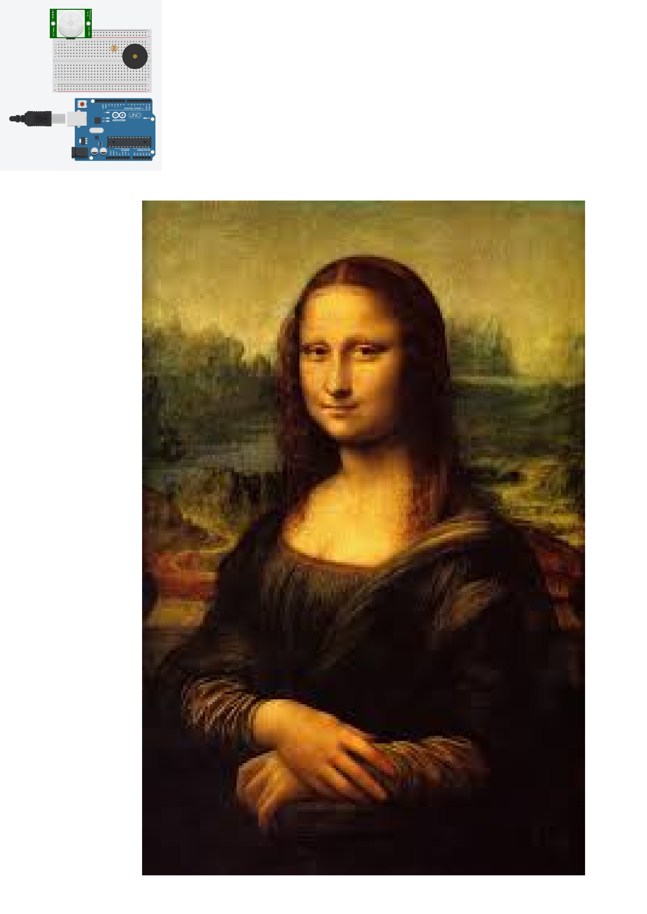
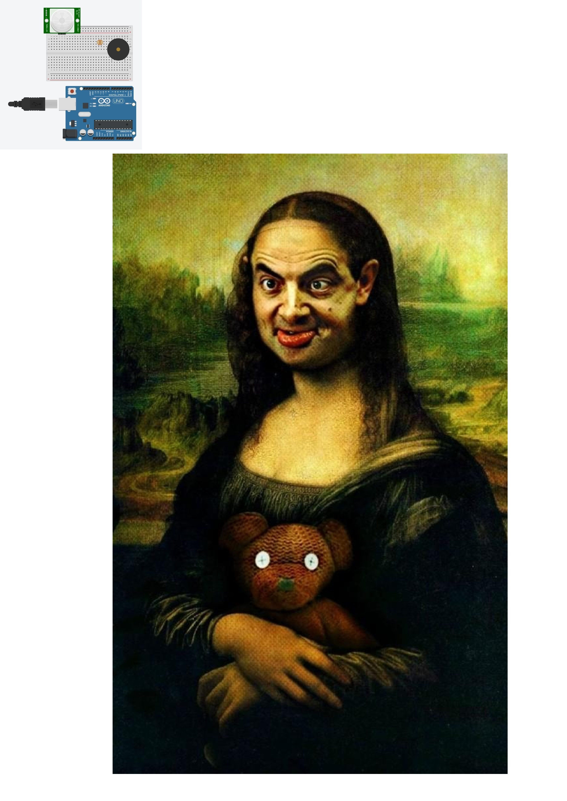
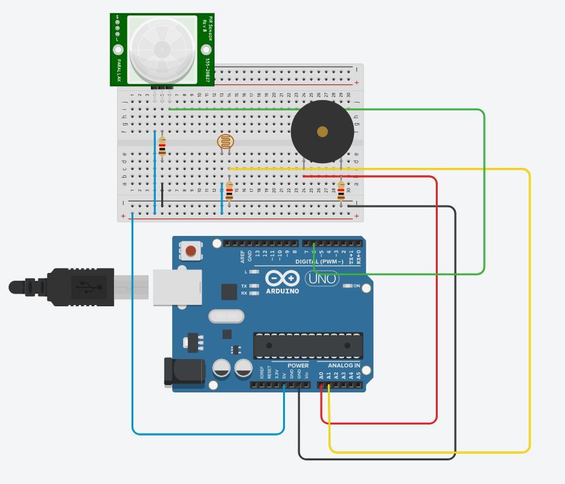

# Midterm IoT Project

Name:  Yiran Ao

Date: Oct. 2017

## Project: PrideArt
### Conceptual Description

PrideArt is a critical response to the concept of e-waste and data ownership. The core of PrideArt is to create a better experience of enjoy an art piece, and remind visitors the importance of respect the art, the ownership of art and do not create/ get rid of waste data.
While visiting art gallery, museum, and show, I noticed that increasingly people went there but they tend to stay less time in front of a single art piece and shift to another one after taking a picture without a second glance, and even worse, someone will turn on the flash light. For some museum goer, visit art exhibition became more like a fashion activity than enjoy the art itself, taking a picture of famous art piece and have a picture in art show is on the top 2 of the must-do checklist. After getting the picture, share it to social network is the second step to show off. There is another type of museum goer, they would take picture at everywhere of everything, but they never look back to the pictures afterwards. Another problem is, almost everyone has a smart phone with them, the message, notification, and push information will distract visitor while they look at exhibit. All the phenomenon above could be considered as a disrespect or disturbing behavior, and data created during the action is sort of waste data. 
PrideArt is a reaction mechanic to those behavior and a reminder of focus and respect through following functionalities:
* Audience need make some effort (spend time) to get access to the art piece
* React to flash light with shut the access
* React to data flow and show the effect of e-waste via visual effect

### Form

To meet the need of function I need two sensors: light sensor and motion sensor. In the Sparkfun kit, the photoresistor and PIR sensor is the right component. And when I think about distractions in gallery I realize the sound of taking picture could also be annoying, so I add a piezo as sound sensor. In this way, the PIR could detect if the visitor stands in front of the art long enough, the photoresistor will catch the rapid light change from flash light, and the piezo would detect sound effect of shutter or any other noise.

**Origin Status:**

**Show the art work:**

**Show the doomed work**

### Technical Details
The following hardware components were used:
*	SparkFun Photon Redboard
*	Piezo speaker
*	Photoresistor 
*	PIR sensor
The PIR sensor will be the trigger of whole program. Once an object stays in the range of PIR sensor for more than 30 seconds, PrideArt will show the art piece. The photoresistor and piezo will surveillance the surrounding, once noise level or light level reach the warning line, program will shut the present of art work and show a doomed version of that art piece. 

PrideArt will also receive the data from network and do the calculation, when the data size (MB) equal to the number of art work’s size (square inch), program will also show the doomed version and send a message to internet "too much data!".

After 5 seconds of the reaction mechanic was triggered, system will be reset to original state.

**Wiring Diagram**

